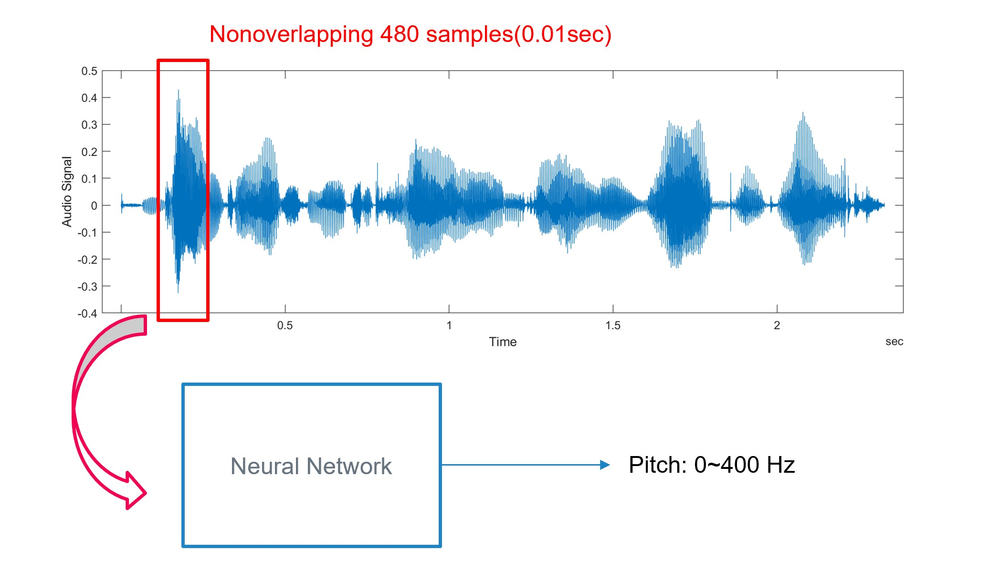
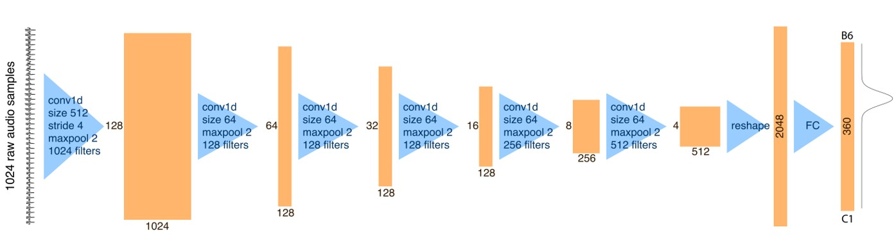

# Pitch-Extraction-with-ML
By training different ML model on Pitch extraction and see the how it performs. It is suprisingly well.

Dataset: PTDB-TUG Database
https://www.spsc.tugraz.at/databases-and-tools/ptdb-tug-pitch-tracking-database-from-graz-university-of-technology.html

Package required to run the code:
matliplot, sklearn, pytorch, signal, spectorgram, numpy, pandas

Please arange all the files and folder in this matter in order to run the code.
```
|-- Pitch extraction with ML
   |--- My Voice(testing voice)
   |--- new_dataset(modified dataset)
   |--- pitch_demo(test file pitch detection with model)
   |--- spec_txt(spectorgram from the training dataset)
   |--- test_dataset(two testing dataset)
   |--- txtfile(labels for the training dataset)
   |--- wave_dataset(the PTDB-TUG database with all the wave files)
```
Run "Dataset Edit.ipynb" first to obtain a better training dataset.
All the code is in the Code folder and is named after different types of model experimented through this project, and all the model parameters will be stored according to there names. 

The insert each frame with 480 samples(10 ms), we can train the model and obtain the pitch that will be assgined to this frame. 



The 6 different models trained in this experiment:
1. Fully connected model
3. Feature model(Data + MFCC)
5. 1D Convolutional Neural Network
7. 2D Convolutional Neural Network
6. Transfer Learning with VGG19 model
7. Crepe package provided in Python


The result of the trained model is given below
[image](img/5.jpg)


All the examples are shown with the two test data in the folder.
test.wav is a female speaker saying "Don't ask me to carry an oily rug like that."
test1.wav is a male speaker saying "The best way to learn is to solve extra problems."
Details and results are written in the report(report folder)
